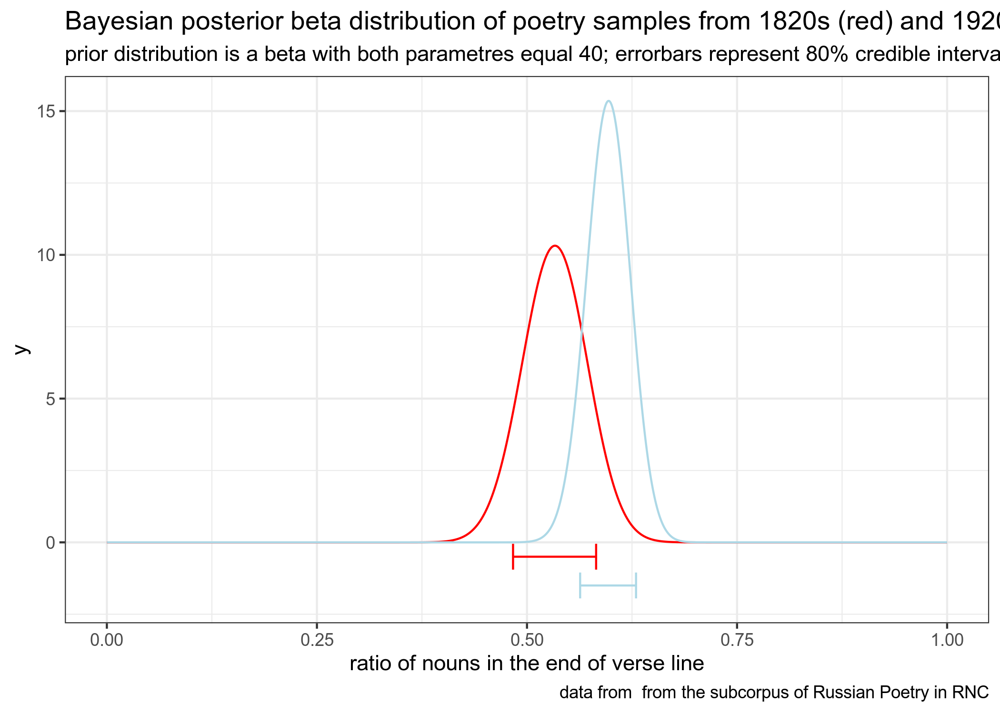
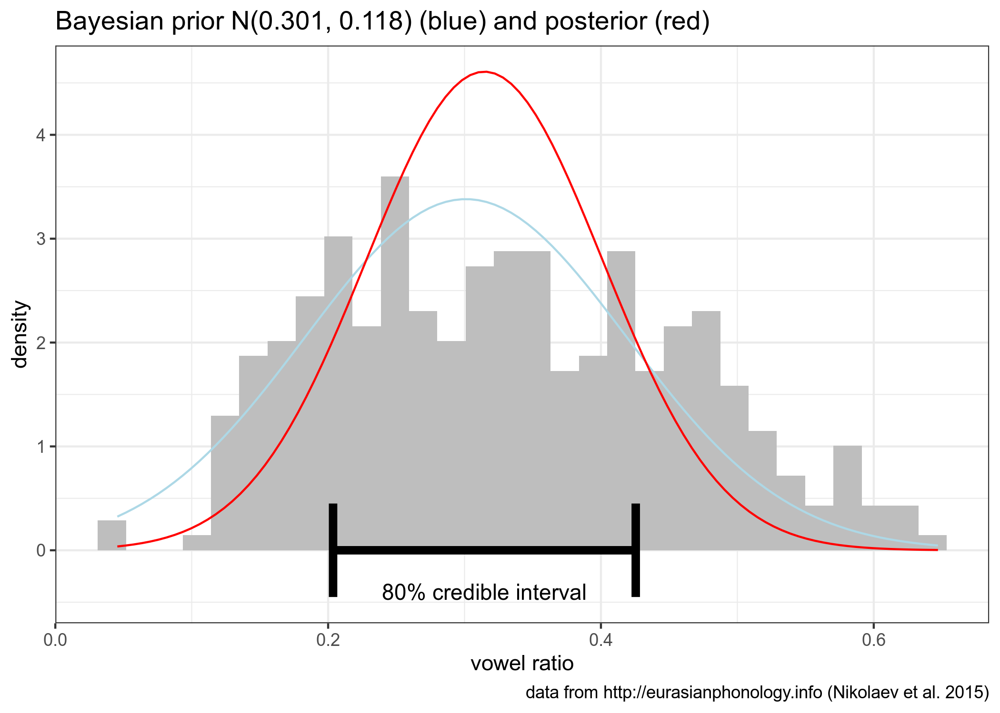

```{r, message=FALSE}
library(tidyverse)
theme_set(theme_bw())
knitr::opts_chunk$set(message = FALSE)
```

## task 2.1 (вес задания: 1)

В датасет `letter_frequency.csv` в вашем репозитории записаны частотности встречаемости букв разных языков согласно Википедии. Вы получили сообщение, содержащее одно слово: "most". Проведите байесовский апдейт, чтобы выяснить на каком языке, согласно модели, написано данное сообщение, исходя из гипотезы, что все языки равновероятны. Посчитайте апостериорную вероятность и выведите в консоль датафрейм, содержащий

* язык с максимальной апостериорной вероятностью;
* само значение апостериорной вероятности.

```{r}
# Ответ на задание 2.1
```

## task 2.2 (вес задания: 2)

В датасете `RNC_verses.csv` в вашем репозитории содержится выборка строчек из стихотворений разных русскоязычных авторов из поэтического подкорпуса НКРЯ (по одной на каждого автора), написанных в 1820 и 1920 годах (данные собрала О. Н. Ляшевская). В переменной `pos` размечена часть речи последнего слова строки. Смоделируйте вероятность появления существительного в конце стихотворения для стихов разных веков, используя априорное бета распределение с параметрами 40 и 40, посчитайте 80% байесовский доверительный интервал и визуализируйте все это на графике (обратите внимание на подписи).



```{r}
# Ответ на задание 2.2
```

## task 2.3 (вес задания: 2)

В датасет `eurasianphonology.csv` в вашем репозитории записаны агрегированные данные из базы данных фонологических систем Евразии <http://eurasianphonology.info> (Nikolaev et al. 2015). Смоделируйте распределение доли гласных из всех сегментов нормальным распределением с априорным нормальным распределением со средним = 0.301 и стандартным отклонением = 0.118, посчитайте 80% байесовский доверительный интервал и визуализируйте все это на графике (обратите внимание на подписи).



```{r}
# Ответ на задание 2.3
```

## task 2.4 (вес задания: 1)

Приведите ниже аргумент(ы) за/против модели в задании 2.3.

...

## task 2.5 (вес задания: 1)

Место для рефлексии по поводу ответов. Заполняется после того, как присланы ответы на задания до 08.03.2021 23:59. Это оцениваемое задание.
